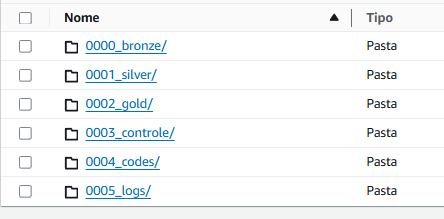

# Criando um Data Lake na AWS
## Índice
- [Resumo](#resumo)
- [Arquitetura AWS utilizada](#arquitetura-aws-utilizada)
- [Ferramentas e linguagens utilizadas](#ferramentas-e-linguagens-utilizadas)
- [Preparação do SGBD](#preparação-do-SGBD)
- [Criação e estruturação do Bucket S3](#criação-e-estruturação-do-Bucket-S3)
- [Criação da instância EC2](#criação-da-instância-EC2)
    - [Acessando a instância EC2 via SSH](#acessando-a-instância-EC2-via-SSH)
    - [Criação da pasta scripts](#criação-da-pasta-scripts)
    - [Instalação do AWS CLI na instância EC2](#instalação-do-AWS-CLI-na-instância-EC2)


## Resumo
O Objetivo desse projeto é a criação de uma Data Lake utilizando a Cloud AWS, para entregar dados prontos para consumo para os Cientistas de dados.

## Arquitetura AWS utilizada

## Ferramentas e linguagens utilizadas
- <span lang="en">python</span>
- SQL
- PySpark
- MySql
- Docker
- Linux
- Jupyter Notebook
- AWS S3
- AWS EC2
- AWS Lambda
- AWS DynamoDB

## Preparação do SGBD
O SGBD utilizado para esse projeto foi o MySql, criado um DataBase e alimentado com essas [tabelas](dados/tabelas.zip) (users, products, sales). As tabelas foram criadas com a biblioteca Faker do python, a tabela sales que é o registro das vendas é a mais extensa, com 500.000 registros até o momento, de 01/01/2021 à 31/09/2024.

## Criação e estruturação do Bucket S3
A estrutura no Bucket S3 utilizada é a seguinte:


- **0000_bronze:** primeira camada do Data Lake, arquivos brutos exatamente como da fonte;
- **0001_silver:** segunda camada do Data Lake, arquivos da camada bronze com tratamento;
- **0002_gold:** terceira camada do Data Lake, books de variáveis prontos para serem utilizados pelos cientistas de dados;
- **0003_controle:** arquivos de controle dos processos entre as camadas;
- **0004_codes:** onde estarão armazenadas as Dags de uso do Airflow e scripts utilizados pelos EMR's;
- **0005_logs:** onde ficarão armazenados os Logs registrados pelos EMR's.

## Grupo de segurança e usuário IAM
Seguindo as orientações da AWS um grupo de usuários foi criado contendo as permissões necessárias para o projeto e vinculado a ele um usuário com chaves de acesso para acessar o AWS CLI que é [instalado](#Instalação-do-AWS-CLI-na-instância-EC2) posteriormente.

## Criação da instância EC2
O tipo de instância utilizada foi uma m5.xlarge com sistema operacional Ubuntu e par de chaves .pem (faça o download da chave em um local que lembre posteriormente), não serão detalhadas as políticas de segurança utilizadas durante o projeto para não extender mas lembre-se de sempre utilizar aquelas com o menor previlégio necessário para o seu caso porque traz uma maior segurança segurança.

### Acessando a instância EC2 via SSH
- Primeiro libera a porta 22 para o seu IP no grupo de segurança vinculado a sua instância EC2.
- Agora para acessar a instância EC2 via prompt, navegue até o caminho onde a chave.pem foi armazenada e execute o comando:
```bash
ssh -i "chave_criada.pem" ubuntu@DNS_publico
```

### Criação da pasta scripts
Foi criada uma pasta **script** na instância EC2, onde foi transferido 3 arquivos:
- [Instalação Docker e Airflow](bash/install_docker_airflow.sh) **:** para instalação do Docker e Airflow na instância EC2;
- [Download da Dags do S3](bash/download_files.sh) **:** para transferir do S3 prara o EC2 as DAGs que serão utilizadas no Airflow.
- [Config](bash/config.cfg) **:** onde estão armazenadas as informações de acesso do mysql local e chave de acesso do usuário IAM

### Instalação Docker e Airflow
- De permissão para executar o arquivo
```bash
chmod +x /home/ubuntu/scripts/install_docker_airflow.sh
```
- Após conceder a permissão execute o arquivo.

- Ao finalizar a instalação, na pasta ~/airflow execute o comando para iniciar o contêiner
```bash
sudo docker compose up -d
```
- Lembre-se de liberar a porta 8080 no grupo de segurança vinculado a sua instância EC2
- Após liberar a porta coloque o seguinte endereço no navegador **dns_publico_da_instância:8080** ;
- O usuário e senha são **airflow** para ambos.

### Instalação do AWS CLI na instância EC2
Para acessar o bucket S2 através da instância EC2 é necessário a instalação do CLI, mas primeiro é necessário instalar 2 ferramentas:
- **unzip**: para descompactar arquivos .zip;
- **curl** : ferramenta para fazer requisições HTTP e baixar arquivos URLs
```bash
sudo apt-get install -y unzip curl
```
- baixe o arquivo de instalação
```bash
sudo apt-get install -y unzip curl
```
- descompactar o arquivo
```bash
unzip awscliv2.zip
```
- instalar o arquivo
```bash
sudo ./aws/install
```
- confirmar a instalação verificando a versão
```bash
aws --version
```
### Configurar AWS CLI na Instância EC2
Execute o comando:
```bash
aws configure
```
Informe os seguintes parâmetros solicitados referente ao usuário IAM: <br>
AWS Access Key ID = *********** <br>
AWS Secret Access Key = *********** <br>
Default region name = região que está utilizando <br>
Default output format = .json <br>

## Transferência das DAGs
Foram utilizadas um total de 7 DAGs para o projeto, divididas em 3 grupos: <br>
- [Ingestão](DAGs/bronze) _ responsáveis pela etapa de extração do MySQL e ingestão na camada bronze no formato **CSV** ;
- [Processamento](DAGs/silver) _ responsáveis pela etapa de tratamento dos dados da camada bronze, alteração do formato para **parquet** e finaliza transferindo os dados para a camada silver;
- [Book](DAGs/gold) _ responsável pela etapa de criação do book de variáveis e armazenamento na camada gold.<br>

**OBS.:** as DAGs das camadas de ingestão e processamento são um total de 3 para cada etapa, porém como em cada camada o que muda é apenas a tabela(assunto), irei deixar anexado apenas um exemplo para cada camada, no caso "products". 

## Camada Bronze
Em cada camada irei relatar um resumo do processo. <br>
Na camada bronze, os dados do mysql Local são acessados pela instância EC2, transformados para csv e armazenados no S3 (camada bronze). <br>
**Detalhes importantes:**
- Os dados de acesso do banco mysql e da chave de acesso do usuário IAM devem estar corretos no arquivo config.cfg


  
